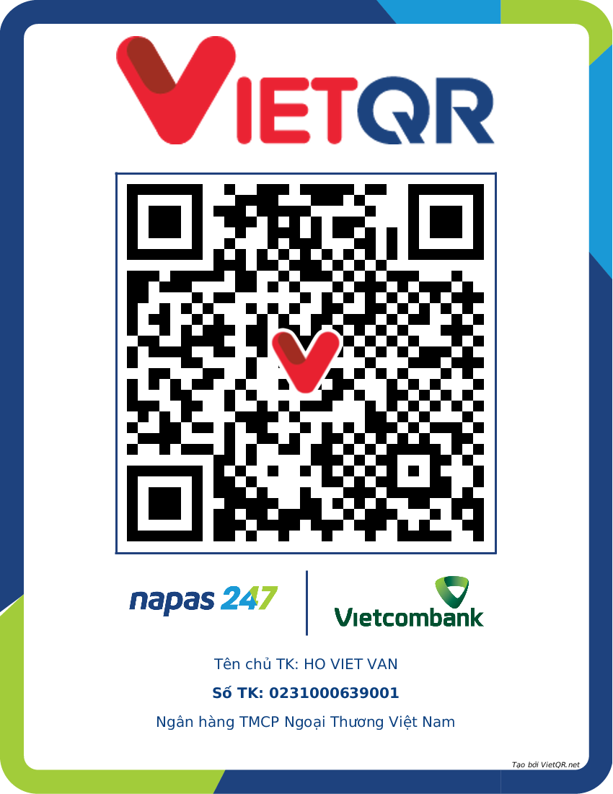

# Search Auto

Search Auto là tiện ích Chrome hỗ trợ tìm kiếm Bing và làm nhiệm vụ Microsoft Rewards hằng ngày.

## Ủng hộ

Nếu project hữu ích, bạn có thể [thêm một sao trên GitHub](https://github.com/vanhobmt99/reward) hoặc ủng hộ qua một trong hai mã sau.

### Vietcombank

- Chủ tài khoản: HO VIET VAN
- Số tài khoản: `0231000639001`
- Ngân hàng: Vietcombank

### MoMo

- Chủ ví: HO VIET VAN
- Số MoMo: `0326363942`

## Tiện ích làm gì?

- Tìm kiếm theo số lần bạn chọn cho **Máy tính** và **Điện thoại**.
- Làm nhiệm vụ Rewards sau khi tìm kiếm nếu tùy chọn này đang bật; bạn cũng có thể chỉ chạy phần nhiệm vụ.
- Chạy ngay hoặc theo lịch, đồng thời hiển thị tiến độ và cho phép dừng từ popup.

## Cài đặt

1. Mở `chrome://extensions` trong Google Chrome và bật **Chế độ dành cho nhà phát triển**.
2. Chọn **Tải tiện ích đã giải nén**, rồi chọn thư mục project này.
3. Ghim **Search Auto** lên thanh công cụ.
4. Đăng nhập tài khoản Microsoft trên Bing và Rewards trong cùng profile Chrome.

**Trình duyệt:** Google Chrome được hỗ trợ đầy đủ hơn. Trên Microsoft Edge, tìm kiếm Bing có thể chạy nhưng Edge có thể chặn tiện ích điều khiển trang Rewards. Khi đó, popup sẽ báo lỗi và giữ tab Rewards mở để bạn làm nhiệm vụ thủ công.

## Chạy một lần

1. Mở popup và nhập số lần tìm trên **Máy tính** và **Điện thoại**. Bạn cũng có thể chọn nhanh `11 · 0`, `21 · 11`, `31 · 21` hoặc `51 · 31`.
2. Bấm **Làm nhiệm vụ**. Tiện ích tìm kiếm theo số lần đã chọn, sau đó làm nhiệm vụ Daily set và các nhiệm vụ còn lại nếu **Tự làm nhiệm vụ sau khi search** đang bật (mặc định bật).
3. Xem tiến độ dưới nút. Khi đang chạy, nút chuyển thành **Dừng**; bấm nút này để dừng.

Giữa hai lần tìm, tab có thể đứng yên theo thời gian chờ đã cài đặt. Nếu chỉ muốn làm nhiệm vụ Rewards mà không tìm kiếm, mở **Nâng cao** và bấm **Chạy** ở mục **Chỉ làm nhiệm vụ**.

## Chạy tự động theo lịch

Mở **Lịch tự động** trong popup, chọn số lần tìm, khoảng chờ và chế độ, rồi bấm **Đặt lịch**.

| Chế độ                                | Khi nào chạy                                                    |
| ------------------------------------- | --------------------------------------------------------------- |
| **Thủ công**                          | Không tự chạy; bấm **Đặt lịch** để chạy một lần ngay.           |
| **Khi mở trình duyệt**                | Bấm **Đặt lịch** để chạy một lần; sau đó tự chạy khi mở Chrome. |
| **~5 phút/lần** hoặc **~15 phút/lần** | Lặp lại theo chu kỳ, có lệch thời gian nhẹ.                     |
| **Hàng ngày lúc…**                    | Chạy mỗi ngày vào giờ đã chọn; mặc định 08:00.                  |

Lịch chỉ hoạt động khi Chrome đang mở. Nếu Chrome tắt vào giờ chạy hằng ngày, lần đó bị bỏ qua và không chạy bù.

## Tùy chọn trong Nâng cao

**Tìm kiếm và nhiệm vụ**

- **Tối thiểu / Tối đa:** khoảng chờ giữa hai lần tìm, tính bằng giây.
- **Chủ đề tìm kiếm:** chọn một chủ đề hoặc để chế độ mặc định tự lấy chủ đề. Nếu nguồn trực tuyến lỗi, tiện ích dùng bộ chủ đề có sẵn.
- **Tự làm nhiệm vụ sau khi search:** bật hoặc tắt bước làm nhiệm vụ Rewards sau khi tìm kiếm.

**Điện thoại và tài khoản**

- **Thiết bị giả lập:** xem thiết bị dùng cho lượt tìm trên điện thoại; nút làm mới chọn thiết bị khác.
- **Tối ưu điểm Mobile:** bật bước dọn dữ liệu Bing cần cho pha tìm kiếm trên điện thoại.
- **Sao lưu & khôi phục đăng nhập Rewards sau Mobile:** giữ thông tin đăng nhập Rewards qua pha Mobile khi có thể.

Các mục **Tải lịch sử tìm kiếm** và **Tải log lỗi** nằm trong phần **Dữ liệu & nhật ký**. Nếu cần xem log chi tiết, bật **Hiện log nâng cao** và mở DevTools của service worker tại `chrome://extensions`.

### Xóa dữ liệu và đặt lại

Các nút màu đỏ có thể xóa dữ liệu hoặc đặt lại tiện ích. Bấm lần đầu để hiện **Chắc chắn?**, rồi bấm lần thứ hai trong khoảng 3 giây để thực hiện.

**Lưu ý:** Mục **Xoá lịch sử tìm kiếm Bing** tìm URL trong 24 giờ gần nhất, nhưng Chrome sẽ xóa mọi lượt truy cập của các URL tìm được, kể cả lượt truy cập cũ hơn.

## Khi gặp sự cố

- **Không có điểm Mobile:** kiểm tra **Tối ưu điểm Mobile** và **Sao lưu & khôi phục đăng nhập Rewards sau Mobile** đã bật; đăng nhập lại Bing/Rewards nếu cần.
- **Chạy bị treo hoặc báo lỗi:** dùng **Đặt lại dữ liệu chạy**, sau đó tải **log lỗi** để xem chi tiết.
- **Nhiệm vụ Rewards không tự bấm trên Edge:** mở tab Rewards đang được giữ lại và làm thủ công trên trang đó.

Trong popup, **Hướng dẫn sử dụng → Mở** mở bản hướng dẫn ngay trong tiện ích.
